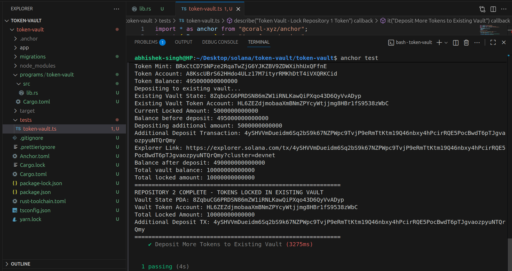
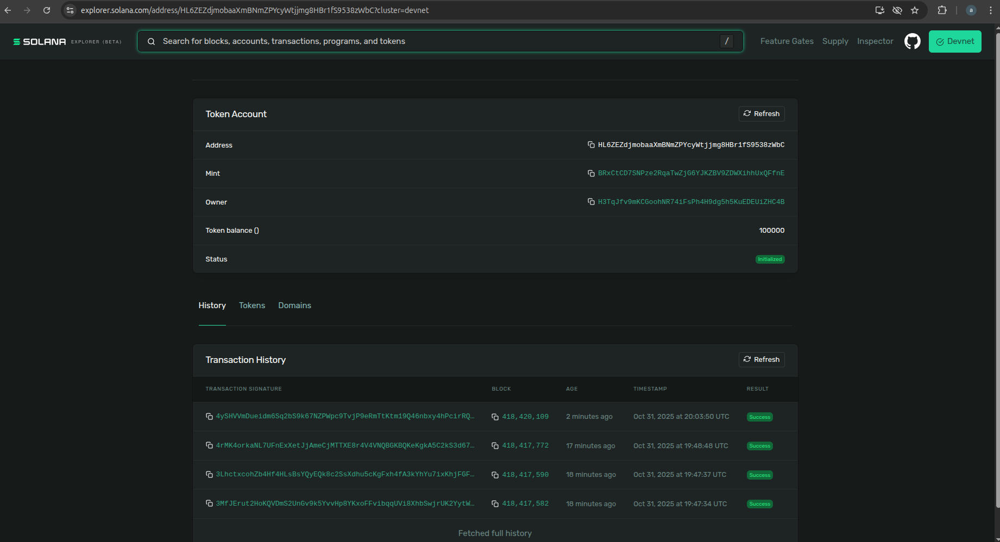

# Token Vault System

## Overview
Secure time-locked vault for NexusCore tokens on Solana Devnet.

## Program Details
- **Program ID**: `EwFjrUDfLEDRA3VHNmGMiG9g4caVraHt47fRiyUP7xuE`
- **Network**: Solana Devnet
- **Framework**: Anchor 0.30.1

## Vault Configuration
- **Token Locked**: `BRxCtCD7SNPze2RqaTwZjG6YJKZBV9ZDWXihhUxQFfnE` (NexusCore token)
- **Vault State PDA**: `8ZqbuCG6PRDSN86mZW1iRNLKawQiPXqo43D6QyVvADyp`
- **Vault Token Account**: `HL6ZEZdjmobaaXmBNmZPYcyWtjjmg8HBr1fS9538zWbC`
- **Locked Amount**: 10,000,000,000,000 (100,000 tokens)

## Transaction Hashes
1. **Vault Initialize**: `3MfJErut2HoKQVDmS2UnGv9k5YvvHp8YKxoFFvibqqUVi8XhbSwjrUK2YytWLCNUqxTth61tNQ2qR1HtQSbUuSji`
2. **Token Deposit/Lock**: `3LhctxcohZb4Hf4HLsBsYQyEQk8c2SsXdhu5cKgFxh4fA3kYhYu7ixKhjFGFBrxruvcB85sv3m1iGZ4nExLpPQrr`

## Screenshots

## Explorer Links
- [Vault Program](https://explorer.solana.com/address/EwFjrUDfLEDRA3VHNmGMiG9g4caVraHt47fRiyUP7xuE?cluster=devnet)
- [Vault State](https://explorer.solana.com/address/8ZqbuCG6PRDSN86mZW1iRNLKawQiPXqo43D6QyVvADyp?cluster=devnet)
- [Locked Tokens](https://explorer.solana.com/address/HL6ZEZdjmobaaXmBNmZPYcyWtjjmg8HBr1fS9538zWbC?cluster=devnet)

